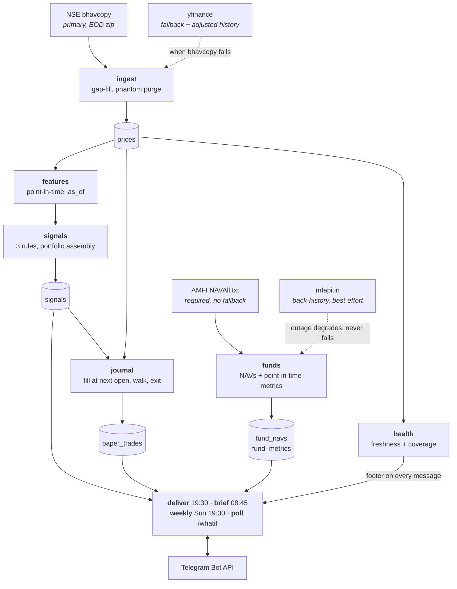

# nse-assist

A single-user daily assistant for the NIFTY 100. Each evening it pulls the day's
bars, computes indicators point-in-time, runs a small set of rules over the
universe, fills and exits **paper** trades against committed risk limits, refreshes
mutual-fund NAVs, and sends the whole picture to Telegram.

Runs entirely on free tiers: GitHub Actions, NSE's public archive, Yahoo's chart
endpoint, the AMFI NAV dump, and the Telegram Bot API. No API keys beyond a
Telegram bot.

---

## What this is, and what it is not

Read this section before the rest. Everything below it is implementation detail;
this part is what the implementation is *for*.

### It is

- **Decision support on end-of-day data.** It reads the closing bars, applies
  stated rules, and shows you what they found with the arithmetic attached. The
  output is an input to your judgement, not a substitute for it.
- **A paper ledger.** `paper_trades` is the product. Every fill and exit is
  simulated against real subsequent bars, net of real Indian transaction costs.
- **An audit trail.** The database is committed after every run, so what the system
  believed on any past date is recoverable, and a backtest can be re-run against
  the exact limits that were live at the time.
- **A measurement instrument, honestly calibrated.** The point-in-time discipline in
  `features.py` exists so the backtest cannot cheat, and the walk-forward validation
  exists so the backtest cannot flatter itself.

### It is not

- **Not investment advice.** Nothing here is a recommendation to buy, sell or hold
  anything. It has no view on your circumstances, tax position, horizon or
  liabilities, and no licence to have one.
- **Not a predictor.** Every number it reports is a description of the past. A rule's
  historical expectancy is not a forecast of its next trade, and the fund digest
  ranks how schemes *have behaved*, not how they will.
- **Not an order router.** There is no broker integration and none is planned.
  Nothing it does reaches a market.
- **Not intraday.** It sees one bar per symbol per day: open, high, low, close,
  volume. It cannot know what happened inside a session, and where that ambiguity
  matters it resolves it against itself — see [Fill logic](#fill-logic-the-shared-contract).
- **Not currently proposing anything.** All three rules are disabled. Walk-forward
  validation found none of them profitable out-of-sample in a majority of windows,
  so the honest output is silence. See [Rule status](#rule-status).

### Rule status

```
momentum_continuation   DISABLED   OOS expectancy  -257.2 per trade
oversold_reversion      DISABLED   OOS expectancy  -669.9 per trade
volume_breakout         DISABLED   OOS expectancy  -662.2 per trade
```

Zero of five walk-forward windows were positive; three of five folds could not find
a profitable parameter cell even in-sample. `oversold_reversion` looked best on the
full sample (+₹121) and came back −₹670 out-of-sample, which is the exact shape of
a rule fitted to its own history.

They are disabled rather than deleted. The record of what was tried and failed is
worth more than the tidiness of removing it — a deleted rule gets reinvented in six
months by someone who does not know it was already measured.

---

## Architecture



All seven tables — `prices`, `signals`, `paper_trades`, `fund_navs`,
`fund_metrics`, `runs`, `app_state` — live in one SQLite file, `output/nse.db`,
which is **committed** after every scheduled run. That is what lets an ephemeral
GitHub runner inherit price history, open positions and the Telegram update offset
from the run before it.

**The one-way rule:** `features.py` reads `prices` and returns values; it never
writes. `signals.py` reads features and writes `signals`; it never touches prices.
`journal.py` reads signals and bars and writes `paper_trades`. Each stage's output
is the next one's only input, which is what makes a stage independently replayable.

**The shared-definition rule:** `journal.py` imports `backtest.resolve_exit` rather
than owning a copy. Two implementations would drift, and the drift would not fail —
it would quietly compare two different strategies and report the difference as
alpha.

### Stage reference

| Stage | Purpose | In the daily run |
|---|---|---|
| `ingest` | Bars from bhavcopy, yfinance fallback, gap fill | yes |
| `features` | Point-in-time indicators as of a date | yes |
| `signals` (alias `scan`) | Run the rules, assemble a portfolio | yes |
| `journal` | Fill proposals, walk open positions, exit | yes |
| `funds` | AMFI NAVs, refresh point-in-time metrics | yes |
| `deliver` | The evening report | yes |
| `brief` | The morning brief | morning cron |
| `weekly` | Sunday review, appends the fund digest | Sunday cron |
| `fund-digest` | The parked-cash section, standalone | on request |
| `gate` | The five frozen evaluation criteria | Sunday cron (in `weekly`) |
| `poll` | Answer `/whatif` commands | 30-min cron |
| `doctor` | 17 health checks + freshness table | weekly cron |
| `backtest` | Replay rules over stored history (minutes) | no |
| `walkforward` | Out-of-sample validation, sets `RULE_ENABLED` | no |
| `backfill` | 3y split-adjusted history per symbol | no |
| `verify-data` | Gaps, discontinuities, impossible bars | no |
| `journal-report` | Live vs backtest, per rule | no |

```bash
python main.py --stage all        # the daily chain
python main.py --stage doctor     # health check, read-only
```

`--dry-run` skips every write and every send.

---

## Zero to running

### 1. Install

```bash
python3 -m venv venv && ./venv/bin/pip install -r requirements.txt
```

### 2. Telegram

Create a bot with [@BotFather](https://t.me/BotFather), then message your new bot
once so it can see your chat. Get the chat id:

```bash
curl -s "https://api.telegram.org/bot<TOKEN>/getUpdates" | grep -o '"id":[0-9-]*' | head -1
```

Copy `.env.example` to `.env` and fill in `TELEGRAM_BOT_TOKEN` and
`TELEGRAM_CHAT_ID`. **Never fill values into `.env.example`** — it is one letter
away from the real file and it is tracked. A real token reached this public repo
that way once.

### 3. Enable the secret guard

```bash
git config core.hooksPath .githooks
```

Refuses any commit staging a filled-in template, a file named `.env`, or anything
shaped like a token. It reads *staged* content, not the working tree, because those
differ the moment a file is edited after `git add`. It never prints the offending
value — a scanner that echoes a secret to prove it found one has copied it into
your scrollback and your CI logs.

### 4. Choose your funds

Which schemes you park cash in is a decision, so it lives in
`src/fund_watchlist.py`, committed. It ships with four placeholder schemes; replace
them with what you actually hold.

```bash
python main.py --stage funds --search "hdfc liquid"
```

Direct and Regular plans have different codes and different NAVs — Regular carries
distributor commission. The shipped codes are all Direct/Growth. Check the plan in
the name before adding one.

### 5. Fill the database

```bash
python main.py --stage ingest --backfill    # ~1 min, ~100k rows
python main.py --stage backfill             # 3y split-adjusted, resumable
python main.py --stage funds --history      # NAV back-history from mfapi.in
python main.py --stage verify-data          # gaps, discontinuities
```

### 6. Confirm

```bash
python main.py --stage doctor
```

17 checks: environment, database, universe, risk coherence, costs, rules, secrets,
sizing coverage, calendar, bhavcopy, yfinance, source integrity, watchlist, AMFI,
mfapi, Telegram, freshness. Any FAIL exits non-zero.

### 7. Scheduling

The five workflows in `.github/workflows/` need `TELEGRAM_BOT_TOKEN` and
`TELEGRAM_CHAT_ID` as secrets in a GitHub **environment named `prod`**. A job that
does not declare `environment: prod` receives an empty string for every `secrets.*`
reference rather than an error — which is why every workflow declares it and then
checks the values are non-empty anyway.

---

## The rhythm, in IST

You are on the receiving end of four scheduled messages and can ask for a fifth.

### Weekday evening — 19:30

The evening run fires 4 hours after the close. `ingest → funds → features →
signals → journal → deliver`. If NSE has not published the bhavcopy yet it waits 30
minutes and retries once, then accepts the yfinance fallback rather than losing the
session.

You get the evening report: what fired today, what is open, the ledger, the latest
fund NAVs, and a health footer. **A signal in this message is not actionable
tonight** — it fills at tomorrow's open, and the entry shown is a close-based
estimate.

### Weekday morning — 08:45

45 minutes before the open. The brief restates last night's signals as decisions
you are about to make: entry estimate, stop, target, share count, capital deployed,
rupees at risk, and what the combined worst case does to your daily loss limit.

**If ingest failed, this message still arrives**, with a `DATA IS BEHIND` block
under the header naming the last good date and how many sessions behind it is. A
silent morning is worse — you cannot tell it from a morning with nothing to report.

### Sunday evening — 19:30

The weekly: per-rule live-versus-backtest drift, the confirmed-versus-solo cohort
split, performance against NIFTY held over the same days, and the
[evaluation gate](#the-evaluation-gate-frozen) — all five frozen criteria with a
pass/fail/insufficient mark and a trend. The parked-cash fund digest is appended to the same message
rather than sent separately — two Telegram messages minutes apart on a Sunday
evening is how both stop being read.

### Sunday morning — 09:00

Doctor runs and only speaks if something failed.

### Any time, 08:00–22:00

Send the bot a command and the next 30-minute poll answers it:

```
/whatif 119091 6 25000
```

"If I had parked ₹25,000 in this scheme for 6 weeks" — answered with every 6-week
window in the past three years: median, best, worst, and the share that ended
negative. Descriptive statistics on history, labelled as such. `/help` for usage.

Commands sent outside the window are not lost; the offset only advances once a
command is answered, so the 08:00 run picks them up. Telegram holds unretrieved
updates for 24 hours, which is the real deadline.

### Cron reference

Crons are **UTC**. GitHub has no timezone setting, so a cron written as though it
were IST fires five and a half hours early.

| Workflow | Cron (UTC) | IST |
|---|---|---|
| `evening` | `0 14 * * 1-5` | 19:30 Mon–Fri |
| `morning` | `15 3 * * 1-5` | 08:45 Mon–Fri |
| `sunday` | `0 14 * * 0` | 19:30 Sunday |
| `doctor` | `30 3 * * 0` | 09:00 Sunday |
| `poll` | `30 2 * * *`, `0,30 3-16 * * *` | 08:00–22:00 daily, every 30 min |

All five share `concurrency: nse-assist-state` with `cancel-in-progress: false`.
They all commit `output/nse.db`, and Telegram permits exactly one `getUpdates`
consumer per bot — a second gets 409 Conflict.

---

## Every knob

Four modules hold decisions rather than configuration. They are committed so a
change shows up as a reviewable diff instead of an invisible environment
difference, and so a backtest can be re-run against the values that were live at
the time.

### `src/risk_config.py` — position sizing and daily limits

| Knob | Default | Changing it |
|---|---|---|
| `CAPITAL_PER_TRADE` | `25_000` | Notional per position. Lowering it shrinks the tradable universe — at ₹5,000 it removes 24 of 99 priced names and pins 20 more at one share. Raising it needs `MAX_TOTAL_CAPITAL` raised too. |
| `MAX_DAILY_LOSS` | `2_500` | Realised + open loss that ends the session. Must stay consistent with `RISK_PER_TRADE_FRACTION × MAX_OPEN_POSITIONS`, or `assert_coherent()` fails the doctor. |
| `DAILY_PROFIT_TARGET` | `5_000` | Hit this and the day is over too. Giving back a good morning is the more expensive failure mode. |
| `MAX_OPEN_POSITIONS` | `5` | Caps concurrent positions. Also caps how far a day's P&L can travel — a daily limit beyond its reach is a **disabled** limit, and the doctor fails on that. |
| `MAX_TOTAL_CAPITAL` | `125_000` | Ceiling on notional across all open positions. Stated separately from `count × per-trade` so it is a decision rather than an accident. |
| `RISK_PER_TRADE_FRACTION` | `0.02` | Derived: `MAX_DAILY_LOSS / MAX_OPEN_POSITIONS / CAPITAL_PER_TRADE`. A fully stopped-out book lands exactly on the daily loss limit. Edit any input without this and the three numbers contradict each other. |
| `MIN_SHARES` | `1` | Below this a signal is dropped. Raising to 2–3 shrinks the universe further but makes every taken position carry the *intended* risk rather than whatever one share happens to be. |
| `ATR_STOP_MULTIPLE` | `1.5` | Stop distance in ATR(14). Wider = fewer shares for the same rupee risk, and fewer stop-outs on noise. |
| `REWARD_RISK_RATIO` | `2.0` | Where the target sits. Below 1.0 needs a win rate above 50% just to break even. |
| `SIGNAL_VALID_SESSIONS` | `2` | A proposal not filled within this many sessions expires. The setup that justified it has moved on. |

`assert_coherent()` catches the edits that are individually reasonable and jointly
wrong. It is called by the doctor stage.

### `src/rules_config.py` — every threshold the rules read

`signals.py` contains **no numeric literals of its own**. A number buried in a rule
body cannot be swept, diffed, or attributed after the fact.

**Rule 1 — momentum continuation**

| Knob | Default | Changing it |
|---|---|---|
| `MOMENTUM_MAX_DIST_FROM_52W_HIGH` | `0.03` | How close to the 52-week high. Looser fires more often and further from the setup. |
| `MOMENTUM_MIN_VOLUME_RATIO` | `1.5` | Volume vs the 20-day average. |
| `MOMENTUM_REQUIRE_ABOVE_SMA` | `50` | Trend filter. Must be a period `features.py` computes. |

**Rule 2 — oversold mean-reversion**

| Knob | Default | Changing it |
|---|---|---|
| `REVERSION_MAX_RSI` | `30.0` | Oversold threshold. Must stay in `(0, 50)`. |
| `REVERSION_TREND_SMA` | `200` | Above it the position is "this pulled back", below it "this is falling". |
| `REVERSION_MAX_ABS_GAP` | `0.03` | Excludes earnings gaps. A repricing is not a dip — the stock is oversold because the facts changed, and mean reversion has no reason to apply. |

**Rule 3 — volume-spike breakout**

| Knob | Default | Changing it |
|---|---|---|
| `BREAKOUT_MIN_VOLUME_RATIO` | `2.5` | Higher than momentum's: a breakout without participation is the classic false one. |
| `BREAKOUT_LOOKBACK_DAYS` | `20` | Must equal `features.BREAKOUT_LOOKBACK`; the doctor enforces it. |

**Levels and universal filters**

| Knob | Default | Changing it |
|---|---|---|
| `STOP_ATR_MULTIPLE` | `1.5` | Stop distance for signal levels. |
| `TARGET_ATR_MULTIPLE` | `2.0` | Must exceed the stop multiple. |
| `MIN_PRICE` | `10.0` | Sub-₹10 names round badly at any size. |
| `MAX_ABS_DAILY_RETURN` | `0.20` | A 20% day is news; wait for it to settle. |

**Ranking, gating and drift**

| Knob | Default | Changing it |
|---|---|---|
| `RULE_ENABLED` | all `False` | Which rules the live scan may emit. Set by `--stage walkforward --apply`. |
| `RULE_EXPECTANCY` | OOS values | Which rule wins a dedupe, and which candidate drops first when a cap binds. |
| `RULE_EXPECTANCY_BASIS` | `"out-of-sample walk-forward"` | Printed in reports. A number loses its provenance the moment nobody remembers where it came from. |
| `RULE_BACKTEST_HIT_RATE` | `0.472 / 0.524 / 0.478` | The comparison target in the weekly drift column. **Still full-sample interim** — a live rate matching these has matched a flattered target. |
| `DEDUPE_TIEBREAK` | `"tighter_stop"` | Applied when expectancies tie. |
| `RANK_BY` | `"turnover"` | Ranks candidates before the profit cap, so the cap keeps the best rather than whichever the scan reached first. |
| `HIT_RATE_DRIFT_FLAG` | `0.15` | Live-vs-backtest gap that earns a flag in the weekly. Same value as the gate's criterion 4. |

The evaluation-gate thresholds also live in `rules_config.py` but are **frozen** —
see [The evaluation gate](#the-evaluation-gate-frozen).

**Tuning discipline.** Change one group at a time and re-measure — moving three
thresholds together produces a number you cannot attribute. A threshold that works
only in a narrow band is not a parameter, it is a coincidence. Re-measure net of
costs. And the point-in-time suite must stay green: a "better" result that arrives
with `tests/test_point_in_time.py` failing is lookahead, not alpha.

### `src/costs.py` — Indian transaction costs

Typical discount-broker rates (Zerodha/Groww-style), snapshot `2026-08`. Statutory
charges change in most Union Budgets. **A wrong rate here does not fail loudly — it
quietly shifts every expectancy figure.**

| Knob | Default | Note |
|---|---|---|
| `RATES_SNAPSHOT` | `"2026-08"` | Printed by the doctor so a stale rate table is visible. |
| `BROKERAGE_DELIVERY` | `0.0` | Discount brokers charge nothing for delivery. |
| `BROKERAGE_INTRADAY_FLAT` / `_PCT` | `20.0` / `0.0003` | Lower of the two. |
| `STT_DELIVERY_BUY` / `_SELL` | `0.001` each | The single largest cost on a delivery round trip. |
| `STT_INTRADAY_SELL` | `0.00025` | Sell side only. |
| `EXCHANGE_TXN` | `0.0000297` | Both legs, both products. |
| `SEBI_TURNOVER` | `0.000001` | ₹10 per crore. |
| `STAMP_DELIVERY` / `_INTRADAY` | `0.00015` / `0.00003` | Buy side only. |
| `GST` | `0.18` | On *services* only — brokerage, exchange, SEBI. Not on STT or stamp duty, which are taxes. |
| `DP_CHARGE_PER_SELL` | `15.93` | **Flat, per scrip.** 0.064% on ₹25,000 but 0.32% on ₹5,000 — a large part of why small delivery positions are inefficient. |
| `SLIPPAGE_PER_SIDE` | `0.0005` | Not a fee anyone bills you: the gap between the assumed and the achieved price. Modelled as a named line so it stays visible. |

At the committed ₹25,000, a delivery round trip costs **₹96 — 0.39% to break
even**. Any edge smaller than that is a loss.

**A short cannot be delivery.** You cannot deliver shares you do not own, so a cash
-segment short must be squared off the same session. Holding one overnight is not
expensive, it is *not possible* — it needs F&O, where one lot of a NIFTY 100 name
is several lakh of notional and cannot be sized to a ₹25,000 position at all.
`short_is_executable()` exists so a backtest cannot price something the market will
not let you do.

### `src/universe.py` — the tradable universe

NIFTY 100 constituents as a committed tuple, snapshot **2026-08-02**. Fetching them
would mean an index reconstitution silently changing what last night's scan looked
at. NSE reconstitutes semi-annually (March and September); diff against
[niftyindices.com](https://www.niftyindices.com/indices/equity/broad-based-indices/nifty-100)
and update in a single commit.

Symbols are NSE trading symbols — the same strings the bhavcopy uses. `ingest.py`
appends the `.NS` suffix Yahoo needs; nothing else should.

Three corrections came out of verifying the snapshot, and they are the kind that
recur: `TATAMOTORS` demerged into `TMPV` and `TMCV` (both carried), United Spirits
trades as `UNITDSPR` not `UNITDSPTS`, and `LTIM` no longer resolves at all.

### `src/holidays_2026.py` and `src/fund_watchlist.py`

The NSE trading calendar covers 2026 only and **raises** outside that year rather
than defaulting to "open" — a guess about whether the exchange was open is worse
than a refusal. The fund watchlist is four Direct/Growth placeholder schemes;
replace them with what you hold.

### Environment (`.env`) — the only non-committed settings

| Variable | Default | Purpose |
|---|---|---|
| `TELEGRAM_BOT_TOKEN` | — | Required. |
| `TELEGRAM_CHAT_ID` | — | Required. Also the authorisation check for `/whatif`. |
| `DB_PATH` | `output/nse.db` | |
| `INGEST_LOOKBACK_DAYS` | `1500` | First-touch history per symbol. 400 is the *minimum* that works at all — features burns 210 bars warming the 200-day average. |
| `REQUEST_TIMEOUT_SECONDS` | `20` | |
| `AMFI_NAV_URL` | AMFI NAVAll.txt | |
| `FUND_SCHEME_CODES` | — | One-off override of the committed watchlist. |

---

## The evaluation gate (frozen)

**Pre-committed 2026-08-02, before a single paper trade existed.** These are the
criteria that decide whether the paper record justifies anything. They are stated
here, in the config, and in the tests, and they are not to be edited after
evaluation begins.

### The five criteria

| # | Criterion | Threshold |
|---|---|---|
| 1 | **Sample** — elapsed time AND closed trades, whichever comes later | ≥ 6 weeks (42 days) **and** ≥ 30 closed trades |
| 2 | **Cumulative P&L**, after all costs and slippage | > 0 |
| 3 | **Expectancy per trade** | > 0 |
| 4 | **Live-vs-backtest hit-rate drift**, worst rule | < 15 percentage points |
| 5 | **Against the index** — paper P&L vs NIFTY over the same days | paper ≥ index (ties pass) |

**All five must hold simultaneously for a PASS.** Four out of five is not a pass.

Each is reported every Sunday as **pass / fail / insufficient-data**, with a trend
computed against the same criterion evaluated a week earlier. Insufficient-data is
a real third state, not a soft fail: it is the honest answer for most of the
window, and collapsing it into "fail" would make an early-and-fine week look
identical to a late-and-broken one.

The overall verdict is **IN PROGRESS** until criterion 1 is met — a criterion
failing in week three is not a verdict, because there are trades still to come.
Once the sample is complete the window is closed and the verdict is final.

### Why they are frozen, and how

The failure this gate exists to prevent is not a bad rule. It is the
reasonable-sounding conversation you have with yourself in week seven, looking at
an expectancy of −₹40 on 28 trades, in which you notice that 30 was always a bit
arbitrary and 15 points was maybe tight for a sample this small. Every step of that
reasoning is defensible. The conclusion is fitted to the result.

The numbers were therefore set at the only moment it was possible to set them
honestly — before there was anything to look at.

`tests/test_gate.py` asserts every threshold by literal value. That looks like
testing that a constant equals itself, and it is, deliberately: **the mechanism is
social, not technical.** An edit to `rules_config.py` fails the suite until this
test is edited too, so relaxing a criterion costs a second commit that says, in the
diff, that a goalpost was moved. It is meant to be annoying.

### A FAIL is a success of the system

If the window closes on a FAIL, the gate did the job it was built for. The
outcomes are: send the rules back for another walk-forward cycle, or keep the
project paper-only permanently. **Both are fine.** The failure would have been
finding this out with real money.

The message says this in the week it prints FAIL, because that is the week nobody
wants to read it.

### A known redundancy, recorded rather than fixed

Criteria 2 and 3 cannot disagree. Expectancy as specified is mean P&L per trade —
net divided by count — so for any non-empty sample the two carry the same sign.
Criterion 3 can never be the one that fails a gate criterion 2 passed.

It is implemented and reported anyway. Quietly dropping a pre-committed criterion
because it turned out to be redundant is the same edit as relaxing one because it
turned out to be strict, and the whole point of freezing them is that neither
happens after the fact. `test_expectancy_and_cumulative_pnl_always_agree` pins the
redundancy so it is known rather than accidental.

```bash
python main.py --stage gate     # standalone; the Sunday weekly embeds it
```

---

## Fill logic: the shared contract

**This is the part future-you will doubt.** Every decision below is deliberately
pessimistic, and each one costs measured rupees in the backtest. The temptation to
relax one will be strong precisely when a rule is close to profitable — which is
exactly when relaxing it would be self-deception.

`backtest.resolve_exit()` is the single definition. `journal.py` imports it. Before
that import existed, `journal.py` had its own exit loop and a 20-session hold
against the backtest's 10 — the live ledger and the backtest were measuring
different strategies and nothing failed.

```python
def resolve_exit(bar, stop, target, held, max_hold=MAX_HOLD_BARS):
    low, high, opening = bar["low"], bar["high"], bar["open"]

    if low is not None and low <= stop:
        return (opening if (opening is not None and opening <= stop) else stop), EXIT_STOP
    if high is not None and high >= target:
        return (opening if (opening is not None and opening >= target) else target), EXIT_TARGET
    if held >= max_hold:
        return bar["close"], EXIT_TIME
    return None, None
```

### 1. Entry is the next bar's open, never the signal bar's close

A signal is generated after the close. Filling at that close would be buying a
price that had already passed — the single most common way a backtest invents an
edge. The entry shown in the evening report and the morning brief is labelled an
*estimate* for the same reason.

**Cost:** measured at +9.5% and +10.4% of a risk-unit across two rules. That gap
between the signal-time estimate and the actual fill was the largest single
contributor to the rules' negative expectancy — larger than time-stops, which
accounted for only 8% of the damage.

### 2. Levels stay anchored to the signal-time estimate

The stop and target are computed when the signal fires and never recomputed from
the actual fill. Recomputing would make the ledger trade something the backtest
never simulated, and would silently re-centre the risk on a price the rule never
evaluated.

### 3. Stop is tested before target — both-hit counts as a stop

A daily bar whose range contains both levels resolves as a **stop**.

Daily data genuinely cannot say which came first. There are three options: assume
the good one, assume the bad one, or discard the bar. Assuming the good one
flatters every ambiguous day for the life of the strategy, and ambiguous days are
not rare — they cluster in exactly the volatile conditions where the rules fire.
Discarding removes real trades and biases the sample. So: the bad one.

### 4. A gap through a level fills at the open

If the open is already past the stop, the fill is the open — worse than the stop.
If the open is already past the target, the fill is the open — better than the
target.

**This asymmetry is not a choice.** It is what a resting order actually does: a
stop order triggered by a gap-down executes at the gapped price, not at the level
you set. Modelling the stop as always filling at exactly the stop price is a
free option nobody grants you.

### 5. An open past either level is a refusal, not a trade

If tomorrow's open is at or through the stop, the position is never entered —
entering below your own stop is not a trade, it is an instant loss you chose to
take. If the open is at or through the target, it is likewise skipped: the move the
rule predicted already happened overnight, and buying it is buying the exit.

Both refusals are made identically in `backtest.simulate_position()` and
`journal.fill_proposed()`.

### 6. Time stop at 10 sessions, exit at that close

Neither level hit within `MAX_HOLD_BARS = 10` sessions and the position closes at
that day's close. A position that has done nothing for two weeks is capital doing
nothing, and an unbounded hold turns a swing rule into a buy-and-hold with extra
steps.

### 7. A proposal expires after 2 sessions unfilled

`SIGNAL_VALID_SESSIONS = 2`. If no slot was free, or the symbol was already held,
or no bar arrived, the proposal waits — but not indefinitely. The setup that
justified it has moved on.

### 8. Costs are charged on both legs, at real rates

Every simulated trade pays STT both ways, exchange and SEBI charges, stamp duty,
GST on the service components, the flat DP charge on the sell, and 0.05% slippage
per side. **₹96 on a ₹25,000 delivery round trip: 0.39% before an edge exists.**

### 9. Idempotency is enforced by the database, not by Python

`paper_trades` has a UNIQUE index on `signal_id`, and fills use `INSERT OR IGNORE`.
Re-running the evening chain finds the row already there and does nothing. A Python
guard would be enough right up until the run that races or the code path that skips
it.

---

## Data-source quirks

### NSE bhavcopy — headers, cookies, and a format change

NSE serves **403 to anything that looks automated**. Two things are required
together: full browser headers, *and* a GET to the homepage first to seed cookies
the archive host expects. Without the cookie prime the download 403s even with
perfect headers. The homepage response itself is often the bot-detection page —
that is fine, the `Set-Cookie` headers arrive either way.

Since 2024 the file is the UDiFF "common bhavcopy":

```
https://nsearchives.nseindia.com/content/cm/BhavCopy_NSE_CM_0_0_0_<YYYYMMDD>_F_0000.csv.zip
```

Columns are `TradDt`, `TckrSymb`, `OpnPric`, `HghPric`, `LwPric`, `ClsPric`,
`TtlTradgVol` — **not** the older `SYMBOL`/`OPEN`/`CLOSE` names, and not the same
URL. Filters: `SctySrs == "EQ"` drops SME, trust and debt series; `FinInstrmTp ==
"STK"` drops the ETFs and index products the CM segment file also carries.

A response that is not a zip means bot detection, not a format change — the parser
says so explicitly rather than failing on a CSV header.

Beyond 15 missing sessions, ingest routes the bulk to yfinance and re-fetches only
the most recent 10 from bhavcopy: 370 sequential requests against a free archive is
neither fast nor polite.

### yfinance — three separate hazards

**`auto_adjust` defaults to `True`.** It is explicitly set to `False`. Left on, it
returns split- and dividend-adjusted prices that silently disagree with bhavcopy's
raw traded values, putting two incompatible series in one column.

**Phantom holiday bars.** Yahoo emits a bar for NSE holidays: zero volume,
`open == high == low == close`, previous close carried forward. There were **518**
in the first backfill. Left in, they flatten RSI and drag the 20-day average volume
down. Ingest rejects them on arrival and purges any already stored; the doctor
fails if either invariant breaks.

This has a subtle consequence: a genuine missing session and a holiday placeholder
are byte-identical, so **the feed can never tell us a trading day went missing**.
Only the exchange can, which is why `fill_gaps()` asks bhavcopy.

**Adjustment is not trustworthy on its own.** Verified against bhavcopy: it fixes
splits correctly (KOTAKBANK 1:5, LICI 1:2), but **TRENT** came back with the factor
applied only from 2026-01-01 while the action was 2026-06-04 — a 33% cliff *inside*
the adjusted series — and **VEDL**'s demerger came back with no adjustment at all
(adjusted/raw ratio exactly 1.0 across a 65% drop). The second is arguably correct,
since a demerger really does remove value, but both break a lookback window.
`--stage verify-data` is the only thing that catches either.

### Source precedence — adjusted outranks the exchange

```
yfinance-adj (3)  >  bhavcopy-adj (3)  >  bhavcopy (2)  >  yfinance (1)
```

Enforced in the SQL conflict clause so a concurrent writer cannot lose the rule.

This looks backwards for a second — bhavcopy is what actually traded. But this
table feeds *indicators*, not settlement, and every indicator reads a window of
past closes. **A raw series is correct only at its right edge:** the moment a symbol
splits, its whole history is wrong by the split factor. `--stage backfill` owns the
history, `--stage ingest` owns the right edge, and adjustment factors are 1.0 until
a corporate action — so the raw bar written each evening is correct as written.

Adjustment bases are never mixed within a date. Two sources sharing a basis may sit
in one day; two bases may not.

**After a split, date coverage cannot tell you a symbol needs re-adjusting.** It
still has every date; only the basis went stale, and the sole symptom is a cliff
where adjusted history meets the raw tail.
`backfill.symbols_needing_readjustment()` finds those, so an ordinary run
self-repairs. `--force` re-adjusts everything, which a change to the ranking itself
requires.

### AMFI NAVAll.txt — the required fund source

Semicolon-delimited, with **bare lines interleaved** that are either a category
header (`Open Ended Schemes(Debt Scheme - Liquid Fund)`) or a fund house
(`HDFC Mutual Fund`). Tracking the former is what makes `--search` useful.

Category naming is inconsistent across those headers — `Hybrid Scheme - Arbitrage
Fund` and `Hybrid Schemes - Arbitrage Fund` both occur — so they are matched as
case-insensitive substrings, never compared for equality.

A wound-up or segregated scheme sits in the file at `0.0000` forever; storing it
would put a fake collapse in the series, so non-positive NAVs are skipped.

**No fallback exists behind this**, so it retries three times with backoff on 5xx
and network errors. 4xx fails immediately — a moved URL does not fix itself.

**Fund NAVs do not share the equity calendar, or one with each other.** Liquid and
overnight funds price every day including weekends, because the underlying paper
accrues daily; arbitrage and duration funds price on business days only. On Sunday
2026-08-02 the liquid scheme had that day's NAV while the arbitrage one still
showed Friday. A missing day is normal and never an error.

Nothing is forward-filled. Padding business-day schemes onto a daily grid would
manufacture zero-change days, dragging volatility down by roughly the square root
of the padding ratio. Annualisation uses each scheme's **measured** observation
count — 325/year for liquid, ~240 for arbitrage — because the *median* gap is 1.0
day for every scheme and only the count separates them. Getting it wrong misstates
annualised volatility by about 16%.

### mfapi.in — the caveat

**It is somebody's side project.** No SLA, no support, and it will be down. It
supplies back-history and nothing else, so an outage costs a start date, not a
stage: daily AMFI pulls accumulate history forward regardless.

Every call is wrapped. On failure the outcome is **recorded** in `app_state`, so a
scheme short on history can say which of two things happened — "we could not fetch
it" versus "this scheme is genuinely new". Both print as `n/a` and mean opposite
things.

Rate discipline: one request at a time, 0.7s pause between schemes, 2 retries.

**Unit face-value restatements.** Both HDFC schemes on the shipped watchlist restate
on 2015-08-30 at ×100.04 — a ₹10 face value becoming ₹1000. Any window crossing that
returns `None` rather than a number. The alternative is dividing by the factor,
which means guessing it, and a wrong guess silently rewrites years of history. Only
**positive** jumps count: a debt fund can genuinely fall 20%+ when a holding is
written down, and that is a real loss that belongs in the numbers.

### Telegram

30s timeout, 3 attempts. 5xx and network errors retry with backoff; **4xx never
does** — a bad token or chat id will not fix itself. Messages over 4096 chars split
on the coarsest separator that works, so a break lands between sections rather than
mid-number.

---

## Troubleshooting

### `bhavcopy failed (403)` or `response was not a zip — bot detection?`

NSE is blocking the runner's IP, which happens intermittently and is not
actionable. The fallback covers it. If it persists for days, check whether the
UDiFF URL format changed — NSE has moved it before.

```bash
python main.py --stage doctor          # 'bhavcopy' check does a real fetch + parse
python main.py --stage ingest          # accepts the fallback
```

### `doctor: freshness FAIL — prices at <date>, expected <date>`

Ingest has not caught up. Every report is already labelling itself stale, so
nothing is silently wrong — but the gap will not close on its own, because ingest
only fetches forward from its watermark.

```bash
python main.py --stage ingest
python main.py --stage verify-data
```

### A symbol 404s every morning

**Suspect a corporate action before suspecting the feed.** Ticker changes and
demergers are the common cause — three NIFTY 100 symbols were already stale when
this was written. Confirm against niftyindices and edit `src/universe.py`.

### `doctor: sizing FAIL — over half the universe cannot be sized`

`CAPITAL_PER_TRADE` is too low for the price distribution. One share is the
smallest tradable unit. At ₹25,000 only BOSCHLTD and SHREECEM are excluded; at
₹5,000, 24 names are.

### `doctor: integrity FAIL — N price jump(s) at a source seam`

Adjusted and raw bars have landed in one series. A price cannot move because the
feed changed, so a large jump exactly at a seam is an artefact by definition.

```bash
python main.py --stage verify-data
python main.py --stage backfill --force
```

### `doctor: risk FAIL — ... can never be reached`

A daily limit is set beyond what `MAX_OPEN_POSITIONS` can produce. It reads as
armed in the config and can never trip. This is the failure mode that looks safest
on paper, which is why it fails the doctor rather than warning.

### Telegram getUpdates conflict (409)

Two pollers, or a webhook, consuming the same bot. Telegram permits exactly one.
Check no `poll` run is already in flight — the shared concurrency group should
prevent it, and a second one running means the group was edited.

### A workflow run fails with `error: cannot pull with rebase`

The state-commit step is pulling before committing. `git pull --rebase` refuses to
run against a dirty tree, and these steps are dirty by construction — the stages
above write to the database the step exists to commit. Commit first, pull after.

### Secrets arrive as empty strings in CI

The job is missing `environment: prod`. A secret referenced but not available
arrives blank rather than erroring. Every workflow checks for emptiness explicitly
because of this.

### `/whatif` answers "no NAV history stored"

The database CI is running against has no fund history — usually because
`output/nse.db` was never committed with data in it, so every run starts empty.

```bash
python main.py --stage funds --history
git add -f output/nse.db && git commit -m "state: seed fund history"
```

### The evening report says 0 signals

Check whether that is "no rule fired" or "no rules enabled" — the message
distinguishes them. All three rules are currently disabled, so it is the latter,
and nothing will fire tomorrow either.

---

## Tests

```bash
python -m unittest discover -s tests -t . -v
```

240 tests. `tests/test_point_in_time.py` is the one that matters. It asserts that
features computed as of date D are identical whether or not the table holds rows
after D — tested both by deleting the future and by multiplying it tenfold, because
deletion alone would let a bug that reads "the last row in the table" pass.

Lookahead bias is the only failure here that produces **a wrong answer you
believe**: a backtest that peeks forward still runs and still reports an edge.
Everything else costs you a correct answer instead.

The cache is the trap in that test and has its own case.
`feature_frame()` memoises by as-of date, so a second computation served from cache
would compare a value against itself and pass against any implementation, however
broken. `test_cache_cannot_mask_a_leak` proves the cache genuinely does go stale.

---

## Things worth knowing before trusting a number

- **A 52-week window is 252 sessions, and `MIN_BARS` is sized to make it real.**
  Computing a "52-week high" from whatever history happens to exist answers a
  different question quietly. The minimum is 260 bars, not the 210 the 200-day
  average alone would need.
- **Sizing is volatility-based.** A wider stop buys fewer shares rather than risking
  more money.
- **Staleness is visible by construction.** Every scheduled message carries a health
  footer stating the date it computed from. Not an alert that fires on a threshold —
  an alert you have not seen for a month is indistinguishable from one that is
  broken.
- **Partial ingest computes on what arrived**, and names what did not. A signal that
  never fired on a symbol nobody looked at is a different thing from one that did
  not fire.
- **A 1-year volatility from a month of data is a number with the wrong label**, and
  unlike a missing value a wrong label is invisible. The dispersion metrics return
  `None` unless observations actually reach back.
- **Rule thresholds were stated, not tuned.** They have not been fitted to anything.
  Re-measure with `--stage backtest` and validate with `--stage walkforward` before
  moving them.
- **`output/nse.db` is committed**, so each scheduled run inherits history from the
  one before. About 12 MB. SQLite does not delta-compress, so daily commits grow
  git history meaningfully — if it gets uncomfortable, move it to a release asset.

---

Paper trades. Not investment advice.
