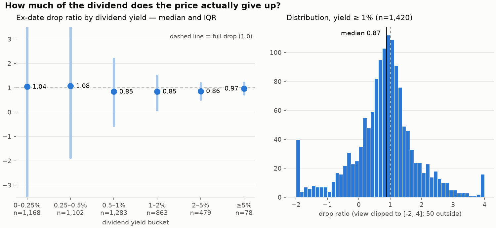
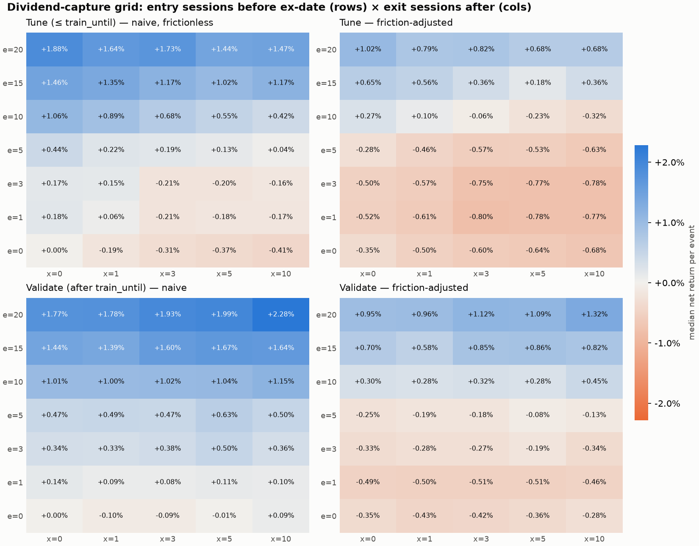

# Results log

Empirical findings from the dividend study, one marker-delimited section
per burst, each regenerated by the script that owns it.

<!-- study_exdate:start -->
## Burst 1 — ex-date drop ratio (2026-08-08)

How much of the dividend the price gives up on ex-date, close-to-close,
adjusted for NIFTY's same-day move (beta 1), as a fraction of the dividend.
1.0 = the full dividend. Measured on 4,973 of 4,982 events,
ex-dates 2016-08-10 to 2026-08-07. Excluded: 2 no prior session, 7 index missing a session.

| subset | n | median ratio | IQR |
|---|---|---|---|
| yield ≥ 2% | 557 | 0.89 | 0.55 to 1.19 |
| yield ≥ 1% (headline) | 1,420 | 0.87 | 0.32 to 1.31 |
| all measurable events | 4,973 | 0.89 | -0.79 to 2.51 |

By yield bucket (noise scales as 1/yield — read the low buckets as noise
floors, not findings):

| yield bucket | n | median ratio | IQR |
|---|---|---|---|
| 0–0.25% | 1,168 | 1.04 | -6.92 to 7.75 |
| 0.25–0.5% | 1,102 | 1.08 | -1.86 to 3.76 |
| 0.5–1% | 1,283 | 0.85 | -0.55 to 2.19 |
| 1–2% | 863 | 0.85 | 0.09 to 1.50 |
| 2–5% | 479 | 0.86 | 0.52 to 1.18 |
| ≥5% | 78 | 0.97 | 0.73 to 1.21 |

Descriptive statistics on history — no strategy is implied, and a ratio
below 1.0 is a pre-tax, pre-cost observation about averages, not an edge.
Regenerate with `python -m data.study_exdate`.
<!-- study_exdate:end -->

<!-- study_grid:start -->
## Burst 4 — tune/validate split (2026-08-08)

Trades through 2022-12-31 tune the grid (97,740 trades); 74,480 trades from later years validate it. Naive = no frictions, no taxes; friction-adjusted = the full cost model.

12 of 35 cells are friction-positive on the tuning period; 12 of those stay positive in validation.

### Selected cell: enter 20 sessions before ex-date, exit 0 after

| period | n | median return | mean return | win rate |
|---|---|---|---|---|
| tune | 2,753 | +1.02% | +1.31% | 55% |
| validate | 2,158 | +0.95% | +1.71% | 56% |

Win rates within the selected cell (friction-adjusted):

| yield | tune n | tune win | validate n | validate win |
|---|---|---|---|---|
| 0–0.5% | 1,142 | 56% | 1,099 | 55% |
| 0.5–1% | 707 | 55% | 561 | 52% |
| 1–2% | 523 | 52% | 328 | 59% |
| ≥2% | 381 | 56% | 170 | 64% |

| liquidity | tune n | tune win | validate n | validate win |
|---|---|---|---|---|
| low | 918 | 54% | 98 | 61% |
| mid | 915 | 57% | 796 | 57% |
| high | 920 | 55% | 1,264 | 55% |

Liquidity buckets are terciles of 60-session average turnover with cutoffs fixed on the tuning period.

**Verdict: a friction-adjusted edge survives out-of-sample in the selected cell** — e=20, x=0 keeps a median +0.95% per event (56% win rate, n=2,158) on years it never saw. The required caveat: a 20-session hold embeds market drift, so this is long-only beta plus perhaps something — an edge over CASH, not yet over the index. Burst 5 must subtract NIFTY over the same windows before this cell is called an anomaly.
<!-- study_grid:end -->
